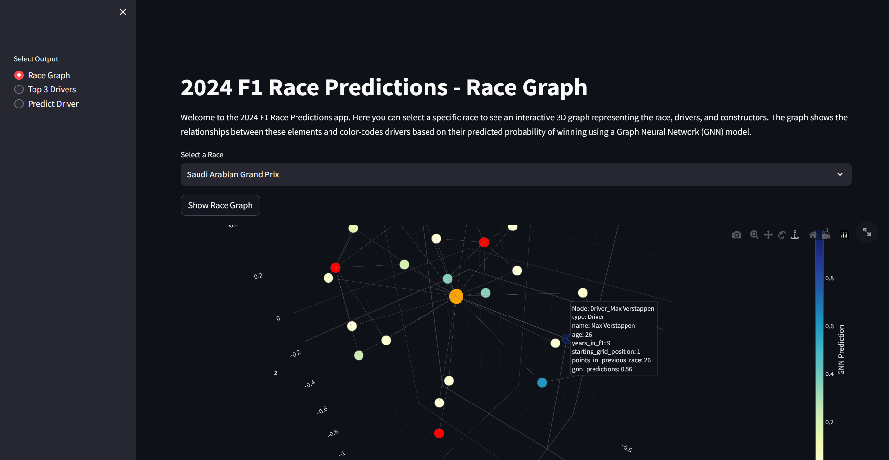
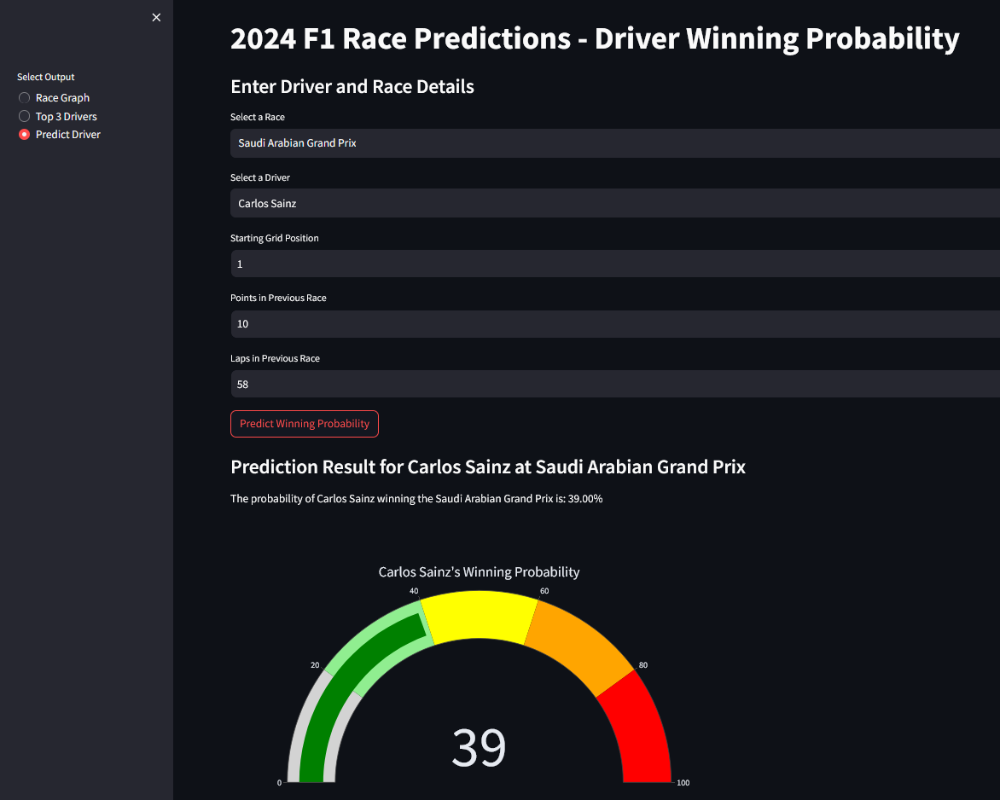

# F1 Race Predictor 2024 🏎️
https://gnn-based-f1-prediction.streamlit.app/

Welcome to the **F1 Race Predictor 2024**! This project predicts the probability of F1 drivers winning specific races using a combination of traditional machine learning models and Graph Neural Networks (GNNs). It also features interactive 3D visualizations to explore race relationships, driver performance, and constructor data.

## Features
1. **3D Interactive Graph Visualization**:
   - View an interactive 3D graph representing races, drivers, and constructors. 
   - Nodes are color-coded based on predictions from a GNN model, with relationships shown between drivers and their constructors for each race.
   
2. **GNN Trained by Random Forest Output**:
   - The GNN is trained using the predictions from a tuned Random Forest (optimized using GridSearch).
   - SMOTE is applied to address data imbalance, ensuring the model remains fair and accurate.

3. **User Input and Predictions**:
   - You can input race-specific details like grid position, points from previous races, and more to make predictions.
   - Results are displayed using a **speed-indicator-type graph** (gauge chart) that shows the probability of a driver's win.

## How to Use
1. **Race Graph**:
   - Select a specific race to visualize the relationships between drivers and constructors.
   - The graph is interactive and allows zooming and rotating in 3D to explore the network.

2. **Top 3 Drivers**:
   - Choose a race to display the top 3 drivers predicted to win, along with a bar chart showing their probabilities.

3. **Driver Winning Probability**:
   - Input driver-specific details like grid position and points to predict the probability of winning the race.
   - The prediction result is visualized with a gauge chart.

